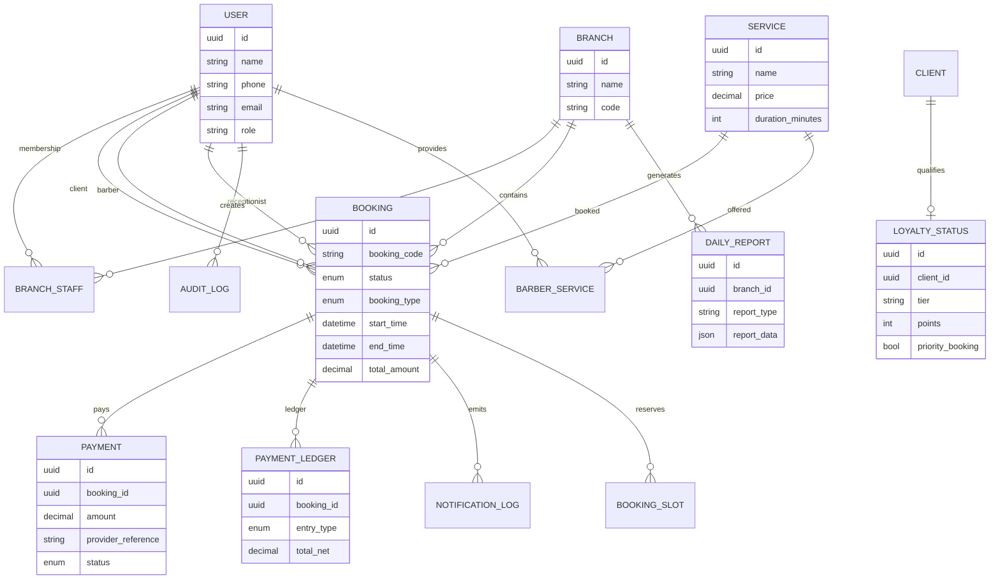

# TrueCut Database ERD

## 1. Entity relationships

## 2. Core database principles

- Each branch is independent but share central user and service catalogs.
- Booking and payment records are separated so financial truth comes from the ledger.
- Slot lock is enforced by a unique constraint on barber plus time.
- Audit records are append-only and tied to user and correlation IDs.
- OTP codes are stored as hashed values and expire with retry limits.

## 3. Required PostgreSQL entities

- branch
- users
- roles
- permissions
- client
- barber
- service
- booking
- recurring_booking
- payment
- payment_ledger
- notification
- audit_log
- otp_verification
- leave_request
- business_settings
- branch_settings
- loyalty_status
- report

## 4. Suggested indexes

- bookings(barber_id, start_time, end_time)
- bookings(branch_id, start_time)
- booking_holds(barber_id, start_time, expires_at)
- payment(provider_reference)
- audit_logs(correlation_id)
- otp_codes(phone, created_at)
- loyalty_status(client_id, tier)
