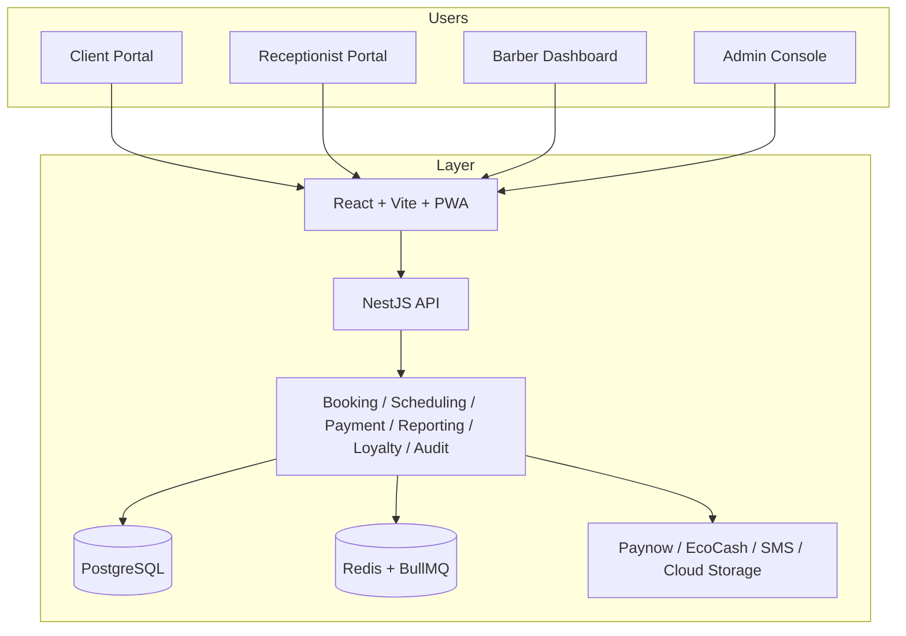

# Phase 1 — System Architecture and ERD

## Architecture decisions

The platform uses a modular monolith for the first production release. This reduces deployment, observability, and operational complexity while keeping domain separation clear enough for future scale.

## System view

## Domain responsibility split

- Authentication: JWT, refresh flow, OTP verification, RBAC
- Booking engine: holds, slots, queue jumps, cancellation policy, recurrent bookings
- Payments: idempotency, ledger, verification, refund workflow
- Loyalty: regular customer rules, points, tiers, priority scheduling
- Reporting: branch and company financial and operational analytics
- Audit: security and business event history
- Offline receptionist: local cache and sync queue

## ERD summary

The data model centers on users, branches, services, bookings, payments, and audit records. Appointment data is isolated from ledger truth to support consistent financial reconciliation.
