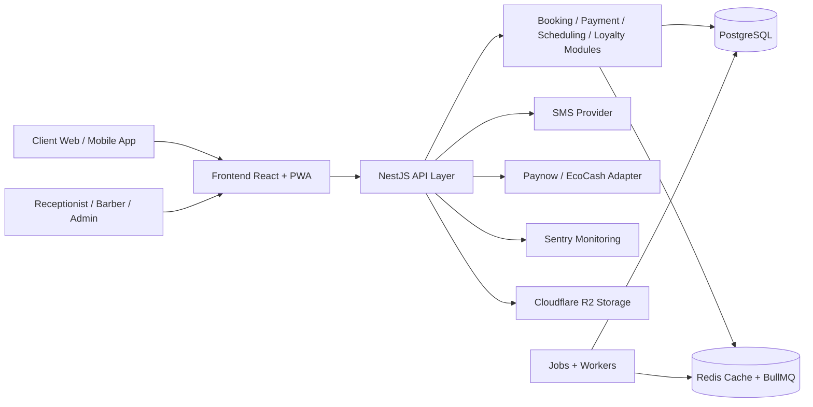

# TrueCut System Architecture

## 1. Overview

TrueCut is designed as a modular monolith: one deployable application with clearly separated domain modules, shared infrastructure, and a single relational database. This gives the team a smaller operational footprint while still supporting multi-branch scale and strong domain isolation.

## 2. High-level architecture

## 3. Core modules

- Authentication Module
  - JWT and refresh token management
  - OTP verification and abuse protection
  - role-aware access control
- User Management Module
  - employees, clients, staff assignment, branch membership
- Branch Module
  - branch configuration, hours, rules, settings
- Client Module
  - client profiles, bookings, loyalty state
- Barber Module
  - schedules, services, availability, leave
- Service Catalogue Module
  - service definitions, pricing, durations
- Booking Engine Module
  - holds, validation, scheduling, double-book prevention
- Payment Module
  - wallet or paynow integration, idempotency, ledger
- Notification Module
  - SMS and in-app event handling with retry queues
- Reporting Module
  - daily financial and operational reporting
- Loyalty Module
  - tiering, ranking, points, referrer rewards
- Audit Module
  - immutable business and security audit records
- Settings Module
  - company and branch configuration management
- Dashboard Module
  - KPI analytics and operational views

## 4. Non-functional requirements captured

- Scalability: transactional write model on PostgreSQL with read-friendly APIs
- Maintainability: module boundaries and shared service interfaces
- Performance: indexed queries, queue-based notifications, caching for schedule views
- Observability: correlation IDs, structured logs, Sentry, health checks
- Security: RBAC, JWT, refresh tokens, rate limiting, input validation, encryption standards
- Fault tolerance: queue retries, webhook polling fallback, idempotency keys
- Cost efficiency: modular monolith, inexpensive first deployment on Render or Railway

## 5. Deployment model

- App runtime: NestJS service behind reverse proxy
- Frontend: Vite SPA served via CDN/static host or Docker container
- Database: PostgreSQL managed instance
- Cache/queue: Redis managed instance
- Storage: Cloudflare R2 for customer and receipt artifacts
- Monitoring: Sentry, health endpoints, uptime checks, structured logging

## 6. Production readiness strategy

- All external effects go through adapters and queue workers
- Payment state is stored in append-only ledger tables, not derived from booking rows
- Slot reservation enforcement uses DB constraints and transactional locking
- Sensitive values such as phone numbers and addresses are encrypted or tokenized at persistence boundary
- All business actions are written to the audit log with before/after payloads
